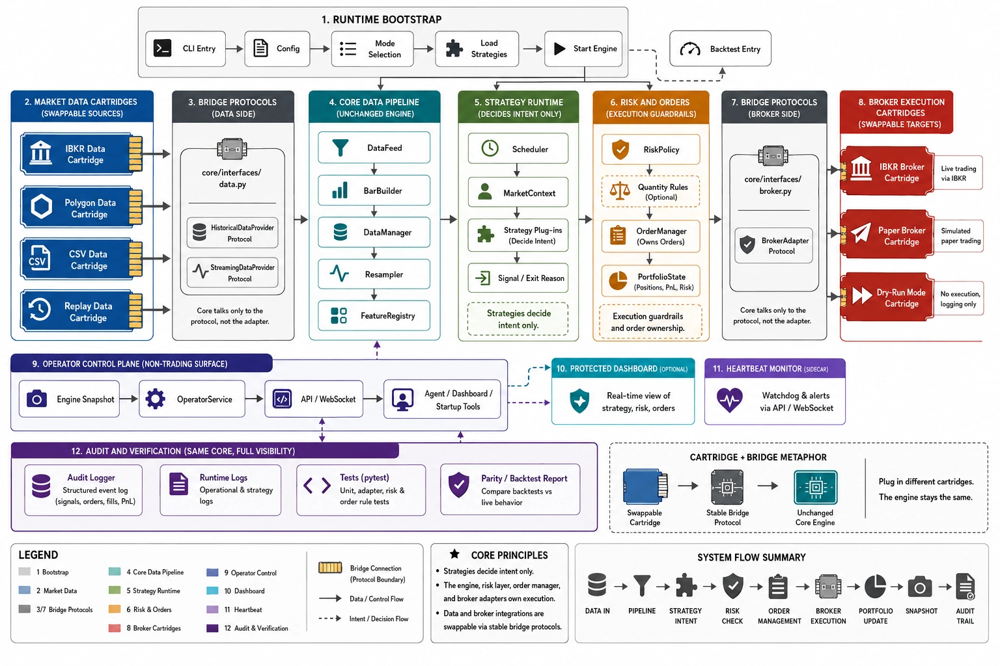

# ibkr_lt

`ibkr_lt` is a modular Python trading framework built around a ports-and-adapters design.

The core idea is simple: the engine is stable, while broker and market-data providers plug in like cartridges through small interface contracts.



## Architecture

- Strategies produce intent only: `Signal` or exit reason.
- The engine owns scheduling, market context construction, risk routing, and execution flow.
- `OrderManager` is the only framework component that submits orders to broker adapters.
- `DataFeed` composes historical and live data providers.
- `DataManager` owns bar storage, deduplication, revisioning, and resampling.
- `FeatureRegistry` computes shared indicators once per instrument/timeframe/revision.

## Cartridge Boundaries

Broker cartridges implement `core/interfaces/broker.py`.

Market-data cartridges implement `core/interfaces/data.py`.

Strategy modules implement `core/interfaces/strategy.py`.

This keeps broker SDKs, data-provider SDKs, and private strategy logic outside the core engine.

## Public Repo Scope

This repository contains the framework, adapters, tests, and public runtime skeleton.

Proprietary strategy implementations, detailed strategy docs, research notebooks, market data, and decision logs are intentionally excluded from Git.

To run the project from a fresh public clone, add your own strategy module under `strategies/` or update `config.yaml` to point at an available local strategy.

## Hermes Control API

The project starts a read-only FastAPI control surface by default for the Hermes agent and operator runtime visibility:

```bash
python main.py --paper
```

Disable it only when needed:

```bash
python main.py --paper --no-api
```

Default URL:

```text
http://127.0.0.1:8550
```

API auth policy:

- Local-only hosts (`127.0.0.1`, `localhost`, `::1`) may run without a token for a local Hermes agent.
- Non-local hosts such as `0.0.0.0` or LAN IPs require `IBKR_LT_API_TOKEN` to be set before startup.
- When a token is set, protected HTTP endpoints require `Authorization: Bearer <token>`.
- `WS /ws/events` accepts the same bearer header or `?token=<token>`.

Public endpoints:

- `GET /api/v1/health`
- `GET /api/v1/meta`
- `GET /api/v1/meta/capabilities`

Protected endpoints:

- `GET /api/v1/runtime/snapshot`
- `GET /api/v1/runtime/strategies`
- `GET /api/v1/positions`
- `GET /api/v1/events`
- `WS /ws/events`

Hermes should call `GET /api/v1/health` first, then use `next_endpoint` to decide whether to poll health again or read `/api/v1/runtime/snapshot`.

The API is intentionally read-only. Manual trading, order cancellation, and startup approval commands should be added later through a command bus with explicit guardrails.

## Audit Logs

When `logging.enabled=true`, runtime output is written under `logs/`.

The default shared config uses quieter owner decision logging:

- `strategy_trigger_decisions.jsonl` appends full decision traces only when a strategy returns an entry signal.
- `strategy_30m_latest_<strategy_id>.json` is overwritten once per configured interval with the latest full diagnostic trace.
- `strategy_decisions.jsonl` is still available by setting `logging.decision_scope: every_eval`.

Signal, order, and fill audit files remain append-only:

- `signals.jsonl`
- `orders.jsonl`
- `fills.jsonl`

## Heartbeat Monitor

`tools/heartbeat_monitor.py` is the separate Hermes watchdog process. It is a read-only API client, not part of the trading runtime.

```bash
python tools/heartbeat_monitor.py
```

Process design:

```text
Agent -----------> ibkr_lt API -> Engine snapshot
Heartbeat Monitor -> ibkr_lt API -> Engine snapshot
Heartbeat Monitor -> Agent/operator alert path
```

The monitor polls `/api/v1/health` every 5 seconds, keeps `/ws/events` connected, pings the WebSocket if no events arrive, and writes local files for an agent to watch:

- `var/heartbeat_monitor/status.json`
- `var/heartbeat_monitor/alerts.jsonl`

When the control API starts, `main.py` warns if no `heartbeat_monitor.py` process is detected. This is part of API startup and is only skipped when the API is disabled with `--no-api`.

Useful options:

```bash
python tools/heartbeat_monitor.py --json
python tools/heartbeat_monitor.py --once --no-files
python tools/heartbeat_monitor.py --api-url http://127.0.0.1:8550 --expect-connected
```

## Tests

```bash
python -m pytest tests/
```

In this workspace, the test suite is normally run with:

```bash
~/.venv/bin/python -m pytest tests/
```

IBKR paper-account tests are opt-in because they connect to TWS/IB Gateway paper and can place paper orders:

```bash
IBKR_LT_RUN_PAPER_TESTS=1 \
IBKR_LT_PAPER_ACCOUNT=DUM408165 \
IBKR_LT_ALLOW_PAPER_MARKET_ORDERS=1 \
~/.venv/bin/python -m pytest tests/paper/ -m paper
```

Without `IBKR_LT_ALLOW_PAPER_MARKET_ORDERS=1`, market-entry tests are skipped. Market-order tests also require the guarded US equity RTH window.
